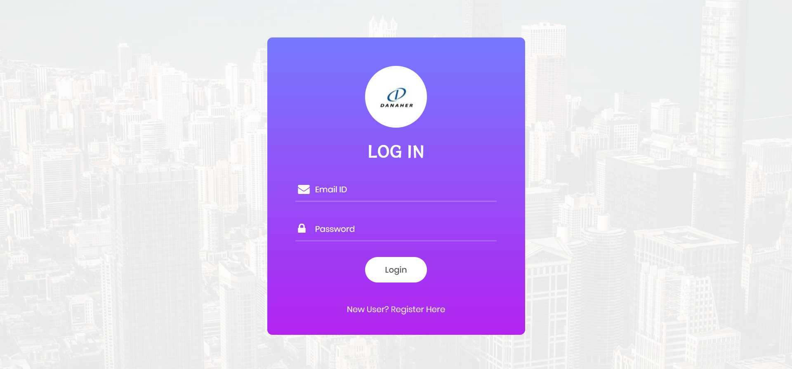
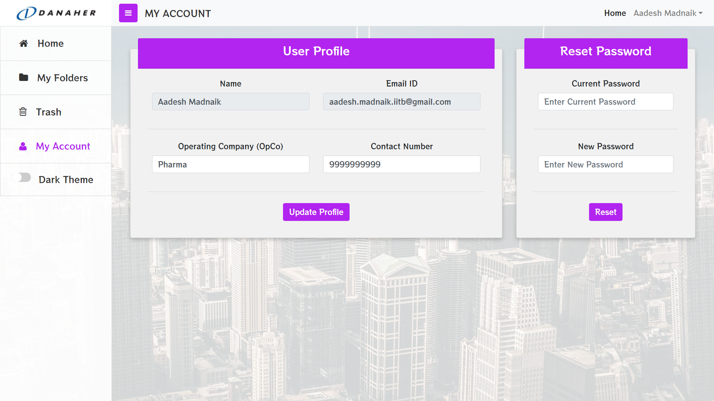
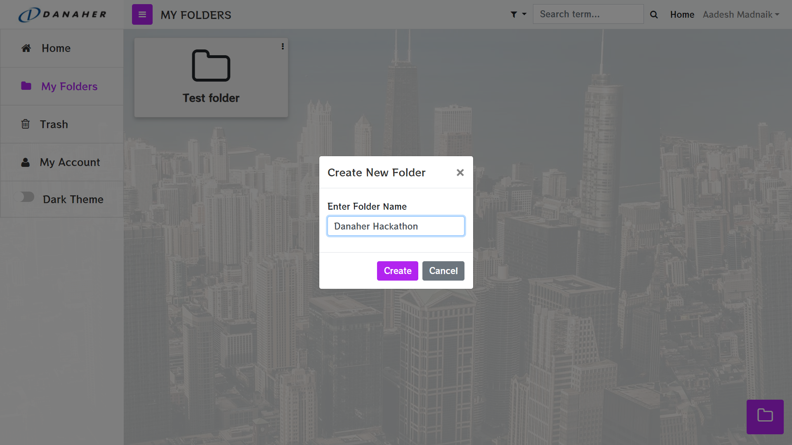
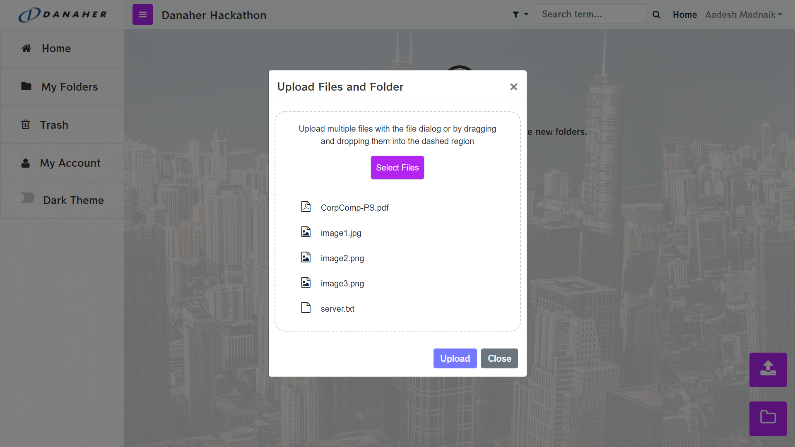
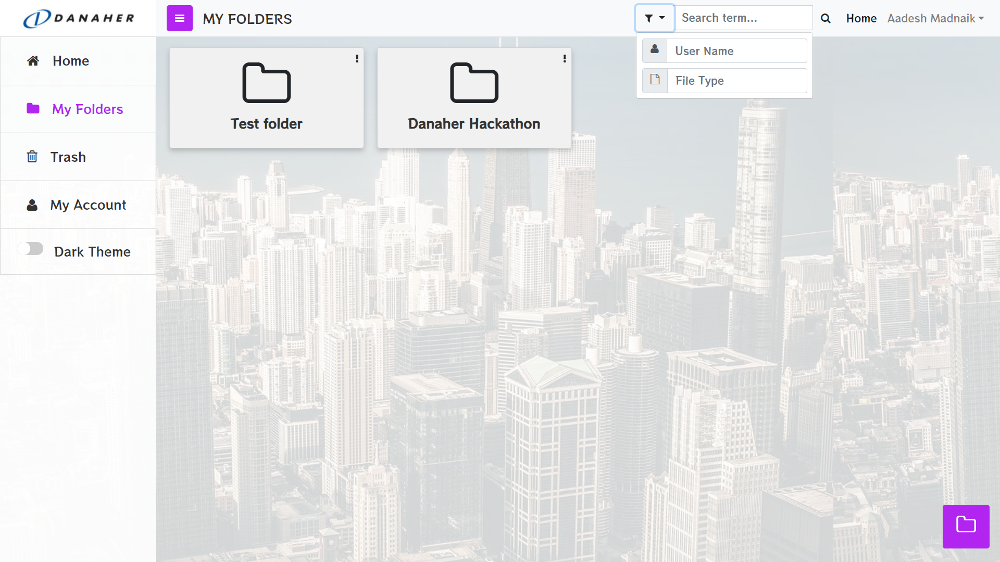
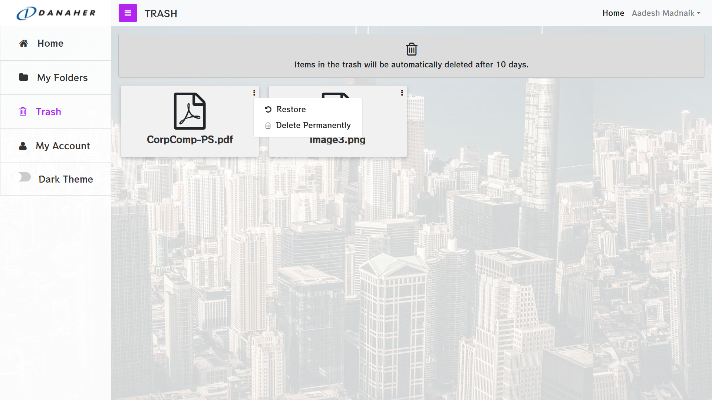
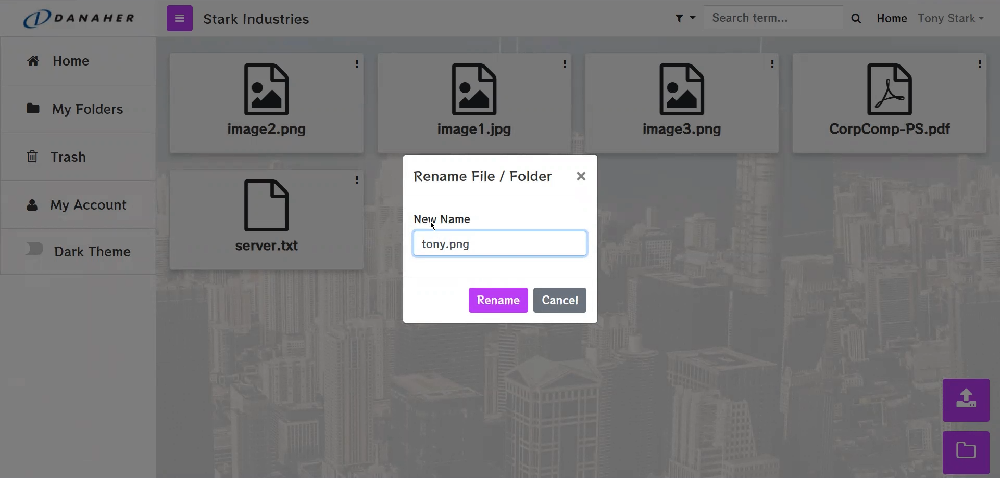
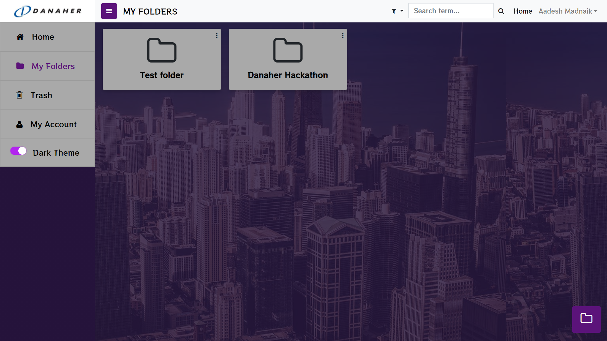

# Danaher-KMR

Knowledge Management Repository for Danaher

## Problem Statement

Need for a digital repository to store documents, photos, and videos and allow ease of access by keywords / topic.

[Link to Detailed Problem Statement](./CorpComp-PS.pdf)

## Demo Video

You can view the walkthrough of our project [here](https://drive.google.com/file/d/1eklKyUh9FIgfR2BPBfqcnEtSSE_1g9Cg/view?usp=sharing)

---

### Usage:

Clone the Repository:

There are two directories inside the cloned folder - `server` and `client`.

To start the client, fire up a terminal and type the following:

```bash
$ cd client

# Install node_modules
$ npm install

# Start client
$ npm start
```

This will start the client at `localhost:3000`.

To start the backend server:

-   Install `mysql` and start `mysql` server
-   Login to `mysql` shell using `mysql -u <username> -p <password>`
-   Create a database named `danaher-kmr` using `CREATE DATABASE danaher_kmr;`

Now you have your database ready to use.

Next, do the following:

```bash
$ cd server

# Create a virtual environment
$ python3 -m venv ./venvs/danaher-kmr
$ source ./venvs/danaher-kmr/bin/activate

# Install the dependencies:
$ pip install -r requirements.txt

# Start the server now
$ python main.py
```

The server will run on `localhost:8000`

The following flags can be used additionally while starng the server:

-   `--init_db`: Initialise dummy valued for users, folders & files into the database
-   `--reload`: For Hot Reloading (mostly used while development)

Now you can register yourself on the portal & leverage all the functionalities that it has to offer.

---

## Features Implemented

### User login and register

The landing page is the login page. A new user needs to first register by filling in some details. Login errors like invalid username or password, and registration errors like already-existent user are appropriately displayed. Passwords are hashed using the SHA256 algorithm before sending to the server.



### User profile and password update

A user can change profile details and reset password via 'My Accounts' page.



### Folder create

Folder can be created via the 'Create New Folder' button in the bottom right corner. Folders created on the Home page (no parent folder) will be directly added to the root folder of the specific month and year (Example - '2021-March' as shown in following GIF). The user can view all folders but can only edit the folders created by him.



### File upload/download

Multiple files can be uploaded (only in the folder created by the user) using the 'Upload Files' button in the bottom right corner, either by dropping them in the dialog box or by clicking on 'Select Files' button.

By clicking on the thumbnail of any file, the user can get the details such as file size and creator. The file can be downloaded via the 'Download' button in the dialog box.



### Search

Files and folders can be searched throughout the database using a keyword for name. Advanced search option is also available to refine the results by filters like username and file type.



### File and folder delete/restore

Any file or folder created by the user can be moved to 'Trash', where it stays for 10 days before being automatically deleted from the database. The user has an option to restore the file/folder within these 10 days to the original location or permanently delete them manually.



### File and Folder rename

The files and folders created by user can be renamed using the 'Rename' option from the dropdown as shown in the following GIF.



### Dark theme



---
